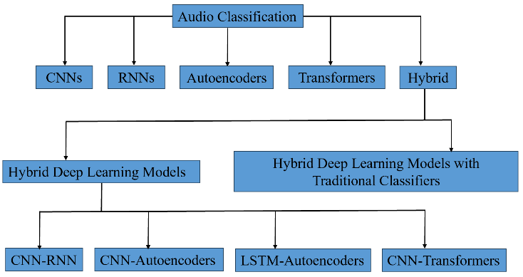
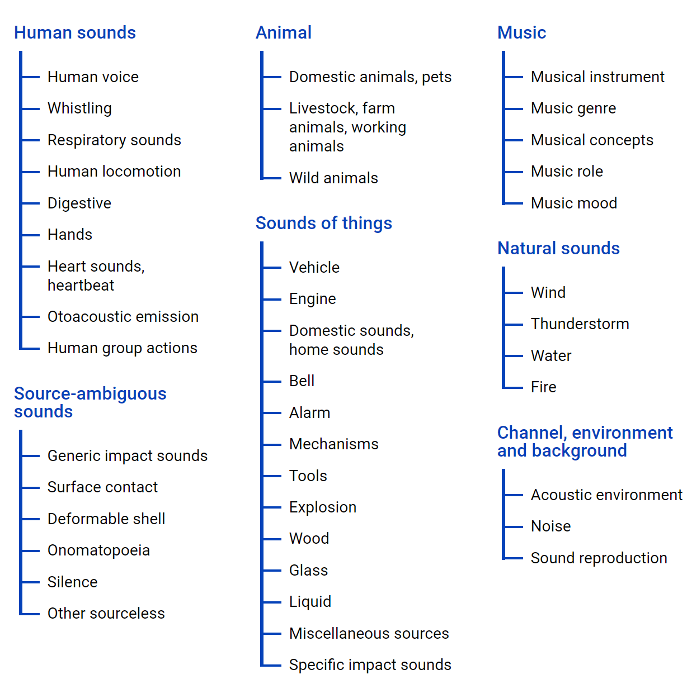
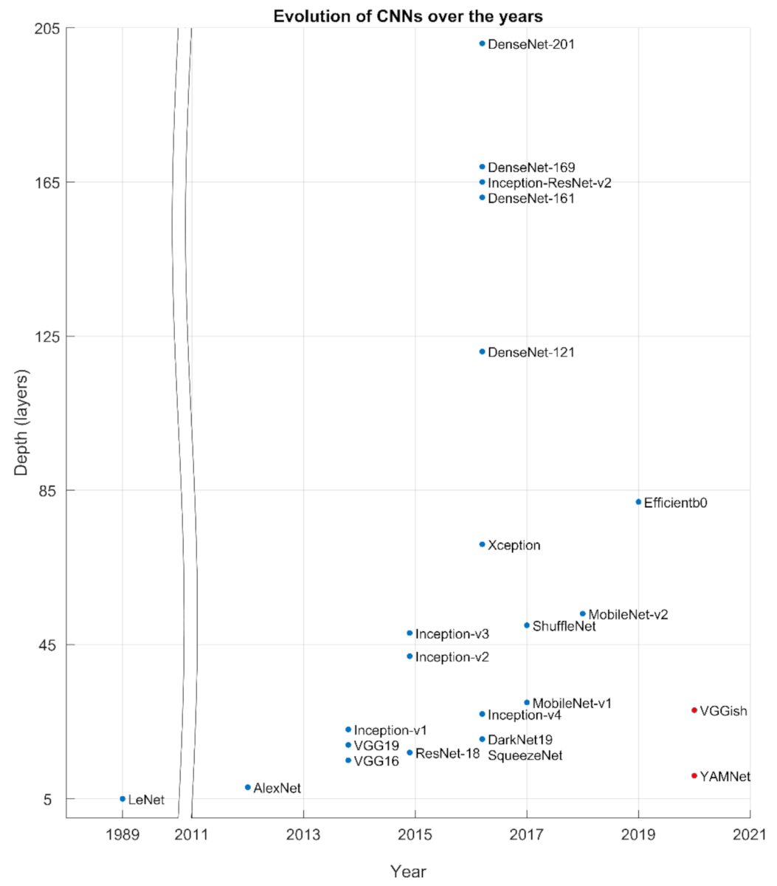

## Acoustic Monitoring of Bat sounds

The study of classyfing animal sounds occuring in their natural environment is called bioacoustics. Animal vocalisations and natural soundscapes are fascinating objects of study, and contain valuable evidence about animal behaviours, populations and ecosystems.

Understanding bat populations and behavior is crucial for their conservation, but these nocturnal creatures are difficult to study directly. Their speed, nighttime activity, and preferred habitats make traditional observation methods impractical. Thankfully, bats use ultrasonic sounds for navigation, making acoustic monitoring a powerful tool for bat research.
 
Thus, classification of the acoustic repertoires of bats into sound types is a useful tool for taxonomic studies, behavioral studies, and for documenting their occurrence.

<!--

-->

## Scalogram-Based Deep Learning Approach 

In the exciting new world of Artificial Intelligence (AI), deep learing-based computer vision (CV) lets computers "see" and classify images. But what if could applied CV to "hear"  and classify sounds? 

Imagine trying to identify a bat species just by listening to its sounds. For decades, scientists relied on acoustic features like pitch and loudness, calculated by hand, to classify sounds. But recently, a new approach has emerged. Deep learning-based CV that can automatically classify images of sound called scalograms.

  

Shown are scalogram images of 3 bat species that are wide spread in the Netherlands: 
Vespertilio_murinus / Plecotus_auritus/ Pipistrellus_pipistrellus.

#

<pre>
The scalogram is defined as the square modulus of the ContinuousWavelet Transform (CWT) 
and is known as a powerful tool for analyzing real-world signals.

The matlab file:
<a href="https://github.com/HR-DATA-FABRIC/CLASSIFYING_ANIMAL_SOUNDS-with-MACHINE_LEARNING/blob/main/Code/BAT_CALL_SCALOGRAM_Matlab_code_example.m">BAT_CALL_SCALOGRAM_Matlab_code_example.m </a>
contains code to compute the scalograms from <a href="https://github.com/HR-DATA-FABRIC/CLASSIFYING_ANIMAL_SOUNDS-with-MACHINE_LEARNING/tree/main/Audio">.WAV bat sound audio-files </a>

Adapted from: GPU Acceleration of Scalograms for Deep Learning
<a href="https://nl.mathworks.com/help/wavelet/ug/gpu-acceleration-scalograms-for-deep-learning.html?searchHighlight=scalogram&s_tid=srchtitle_support_results_2_scalogram">Matworks:Wavelet</a>
</pre>

## Computer Vision driven Audio Classification
Computer Vision driven Audio Classification marries the two domains by applying the principles of visual understanding to audio data. It leverages deep learning techniques to "see" sound, just as it would with images. This innovation has opened doors to automatically determine bat species based on acoustic sound montoring alone.
 
 

*****

<pre>

Figure adapted from: 
Scarpiniti, M.; Parisi, R.; Lee, Y.-C. 
A Scalogram-Based CNN Approach for Audio Classification in Construction Sites. Appl. Sci. 2024, 14, 90. 
<a href="https://doi.org/10.3390/app14010090">https://doi.org/10.3390/app14010090t_databases</a>
</pre>

<!--

-->

## Research Aim

Motivated by the above stated considerations, we propose a Transfer Learning" approach for the
automatic monitoring of bats sounds by developing a Computer Vision-driven Deep Learning based  AI-model for Audio Classification of bat sound scalograms.

## Dataset

Initially, --- to provide a Proof-of-Concept  (PoC)--- we will start using the  [ChiroVox website](https://www.chirovox.org/stat.php), the home of bat recordings from all over the world. The site is intended to facilitate work with bat sounds and is based on the Asian Bat Call Database, an initiative of the Hungarian Natural History Museum (HNHM) and the Southeast Asian Bat Conservation Research Unit (SEABCRU). 

<pre>
Matlab code is provided here that allows you to locally download all avaiable bat sound audio-files that are contained in the ChiroVox database.
<a href="https://github.com/HR-DATA-FABRIC/CLASSIFYING_ANIMAL_SOUNDS-with-MACHINE_LEARNING/blob/main/Code/DownLoad_Locally_ChiroVOX_Species_wav_filesMatlab_code_example.m">DownLoad_Locally_ChiroVOX_Species_wav_filesMatlab_code_example.m</a>
</pre>

In addition,  we will use recodinglist database from the [Xeno-canto Foundation](https://xeno-canto.org/collection/). It is a [citizen science project](https://en.wikipedia.org/wiki/Xeno-canto) and repository in which volunteers record, upload and annotate recordings of bird calls and sounds of orthoptera and bats from Europe, including the Netherlands. It is sponsed by [Naturalis Biodiversity Center](https://www.naturalis.nl/).

In a later phase we will add bat sound recordings from [species](https://www.vleermuis.net/329-geluiden/215-vleermuisgeluiden) that naturally occure in the Netherlands. These recordings will be made available through (DataverseNL)[https://dataverse.nl/] under a creative commons zero license [(CC0)](https://creativecommons.org/public-domain/cc0/).

#

## Research Approach: Transfer Learning

We aim to develop a Audio Classification Model dedicated to bat sound analysis using a transfer learning approach with high-resolution scalogram images as input data. We will start by implementing Matlab's audioPretrainedNetwork [Matlab Mathworks](https://nl.mathworks.com/help/audio/ref/audiopretrainednetwork.html#description) that allows to [implement](https://nl.mathworks.com/help/deeplearning/ug/transfer-learning-with-audio-networks-in-deep-network-designer.html) transfer learning with a specified pretrained audio neural network like YAMnet or VGGish. We will compare this to [Google's Tensorflow implementation](https://www.tensorflow.org/tutorials/audio/transfer_learning_audio) of transfer learning with YAMNet for environmental sound classification and [Pytorch Audio classification](https://bamblebam.medium.com/audio-classification-and-regression-using-pytorch-48db77b3a5ec).

Shown is a taxonomy of Deep learning architectures commonly used for audio classification:  

Convolutional Neural Networks (CNNs), Recurrent Neural Networks (RNNs), autoencoders, transformers and hybrid models (hybrid deep learning models, such as CNN-RNN and hybrid deep learning models with traditional classifiers such as CNN-SVM).

The most promising open-source pre-trained deep learning audio classifiers are Audio Spectrogram Transformer models according to  [Papers with Code](https://paperswithcode.com/task/audio-classification). 

 These models are trained with [AudioSet](https://research.google.com/audioset/). It consists of an expanding ontology of 632 audio event classes and a collection of 2,084,320 human-labeled 10-second sound clips drawn from YouTube videos. See also [List of datasets for machine-learning research](https://en.wikipedia.org/wiki/List_of_datasets_for_machine-learning_research) + The AudioSet ontology is a collection of sound events organized in a hierarchy [(see also)](https://research.google.com/audioset/ontology/index.html)

<!--
https://paperswithcode.com/sota/audio-classification-on-audioset
 The most prommising model as VGGish and Yamnet
--> 

                 

## Studied Materials

* Borowiec, M. L., Dikow, R. B., Frandsen, P. B., McKeeken, A., Valentini, G., & White, A. E. (2022). *Deep learning as a tool for ecology and evolution.* In:  Methods in Ecology and Evolution, 13, 1640–1660. https://doi.org/10.1111/2041-210X.13901

* Ren, Z., Qian, K., Zhang, Z., Pandit, V., Baird A., & Schuller, B. (2018). *Deep Scalogram Representations for Acoustic Scene Classification.* In: IEEE/CAA Journal of Automatica Sinica, vol. 5, no. 3, pp. 662-669. https://10.1109/JAS.2018.7511066.

* Jung K, Molinari J, Kalko EKV (2014). *Driving Factors for the Evolution of Species-Specific Echolocation Call Design in New World Free-Tailed Bats (Molossidae).* In: PLoS ONE 9(1): e85279. https://doi.org/10.1371/journal.pone.0085279

* Stowell D. (2022). *Computational bioacoustics with deep learning: a review and roadmap.* In: PeerJ. 10:e13152. https://doi.org/10.7717/peerj.13152.

* Görföl T, Huang JC, Csorba G, Győrössy D, Estók P, Kingston T, Szabadi KL, McArthur E, Senawi J, Furey NM, Tu VT, Thong VD, Khan FAA, Jinggong ER, Donnelly M, Kumaran JV, Liu J, Chen S, Tuanmu M, Ho Y, Chang H, Elias N, Abdullah N, Lim L, Squire CD, Zsebők S. (2022). *ChiroVox: a public library of bat calls.*
In: PeerJ 10:e12445 https://doi.org/10.7717/peerj.12445

* Oswald, J.N., Erbe, C., Gannon, W.L., Madhusudhana, S., Thomas, J.A. (2022). *Detection and Classification Methods for Animal Sounds.* In: Erbe, C., Thomas, J.A. (eds) Exploring Animal Behavior Through Sound: Volume 1. Springer, Cham. https://doi.org/10.1007/978-3-030-97540-1_8

* Scarpiniti M, Parisi R, Lee Y-C. *A Scalogram-Based CNN Approach for Audio Classification in Construction Sites.* In: Applied Sciences. (2024) 14(1):90. https://doi.org/10.3390/app14010090

* Aburakhia, S., Shami, A., & Karagiannidis, G. K. (2024). *On the Intersection of Signal Processing and Machine Learning: A Use Case-Driven Analysis Approach.* arXiv preprint.  https://doi.org/10.48550/arXiv.2403.17181

* Tsalera, E.; Papadakis, A.; Samarakou, M. (2021). *Comparison of Pre-Trained CNNs for Audio Classification Using Transfer Learning.* In: J. Sens. Actuator Netw. Vol. 10, no. 72. https://doi.org/10.3390/jsan10040072

* Cappellazzo, U., Falavigna, D., Brutti, A., & Ravanelli, M. (2023). Parameter-Efficient Transfer Learning of Audio Spectrogram Transformers. arXiv preprint.  https://doi.org/10.48550/arXiv.2403.17181

* Elsa SteinfathAdrian Palacios-MuñozJulian R RottschäferDeniz YuezakJan Clemens (2021) Fast and accurate annotation of acoustic signals with deep neural networks eLife 10:e68837.
https://doi.org/10.7554/eLife.68837

* Abayomi-Alli OO, Damaševičius R, Qazi A, Adedoyin-Olowe M, Misra S. Data Augmentation and Deep Learning Methods in Sound Classification: A Systematic Review. Electronics. 2022; 11(22):3795. https://doi.org/10.3390/electronics11223795

* Michaud, F., Sueur, J., Le Cesne, M., & Haupert, S. (2023). *Unsupervised classification to improve the quality of a bird song recording dataset.* In:  Ecological Informatics, 74, 101952.
https://doi.org/10.1016/j.ecoinf.2022.101952

* Srivastava, S., & Sharma, G. (2024). Omnivec: Learning robust representations with cross modal sharing. In Proceedings of the IEEE/CVF Winter Conference on Applications of Computer Vision (pp. 1236-1248).

* Chen, S., Wu, Y., Wang, C., Liu, S., Tompkins, D., Chen, Z., & Wei, F. (2022). Beats: Audio pre-training with acoustic tokenizers. arXiv preprint https://arxiv.org/abs/2212.09058v1